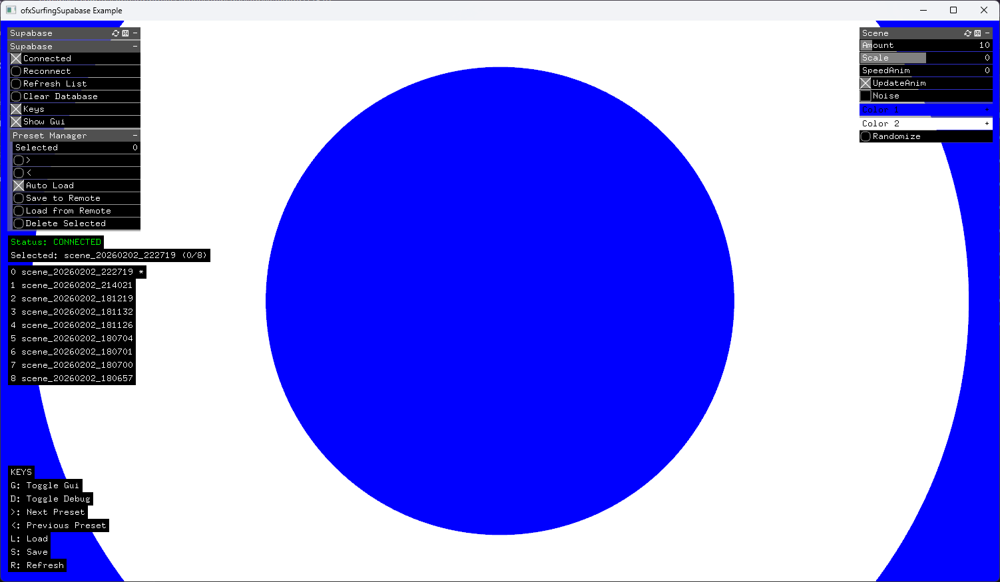

# ofxSurfingSupabase

### _WIP: blueprint currenltly under development. Use at your own risk!_
### _Login works but preset saving/loading workflow may have issues._



Presets (**ofParametersGroup**) management with Supabase backend database for openFrameworks.

## Example

Basic example demonstrating **pure remote mode** with **Supabase** integration.  
Scene parameters are saved and loaded **directly** to/from the cloud database without using any local JSON files.

---

## Features Demonstrated

✅ Email/Password authentication  
✅ Direct scene parameter save/load  
✅ Browse remote presets  
✅ No local JSON files (cloud-first)  
✅ ofxGui integration  

---

## Setup

### 1. Configure Supabase

Follow **[docs/SUPABASE-SETUP.md](docs/SUPABASE-SETUP.md)** to:
- Create Supabase project
- Create `presets` table
- Create test user
- Get credentials

### 2. Configure Credentials

Edit `bin/data/credentials.txt`:
```txt
AUTH_MODE=EMAIL_PASSWORD
SUPABASE_URL=https://your-project.supabase.co
SUPABASE_ANON_KEY=eyJhbGc...your_anon_key
EMAIL=test@ofxsurfing.com
PASSWORD=testpass123
```

---

## Workflow

1. **Adjust scene parameters** (colors, amount, scale, etc.)
2. **Browse presets** with arrow keys or ◀ ▶ buttons
3. **Press S** or click "Save To Remote" → Uploads to cloud
4. **Press L** or click "Load & Apply" → Restores from cloud
5. **NO local JSON files** are created (pure remote)
6. Use **Auto Load** to auto-load on preset index change

---

## Code Structure

```cpp
// Setup
db.setup(scene.params); // Link to scene`s ofParameterGroup
```

---

## TODO

- Threading loader to avoid blocking UI
- Fix overwrite, new preset, save copy... preset issues
- Integrate with your own external presets manager
- Add custom preset naming
- Add user login authentication UI, auth0
- Implement preset categories/tags to handle multiple kits